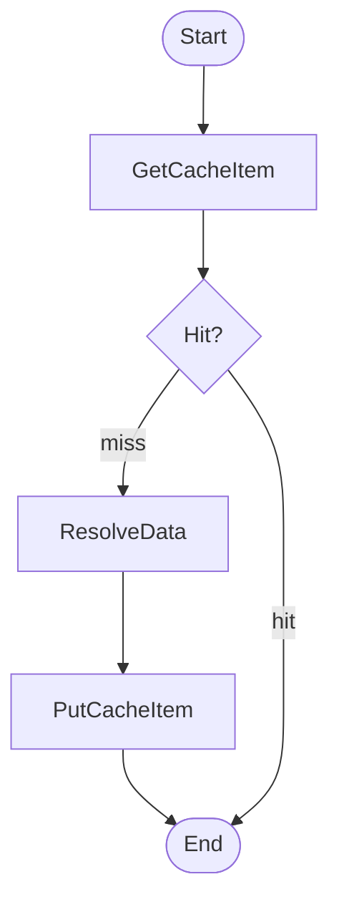

This project contains utility functions and type definitions for interacting with [Momento](https://www.gomomento.com/)'s API from AWS AppSync HTTP Resolvers written in JavaScript (APPSYNC_JS runtime).

Use this library if you want to use Momento as a caching layer for your resolver.

## How to install

```bash
npm i appsync-momento-utils
```

## How it works

To use this library, you will need:

- An [HTTP resolver](https://docs.aws.amazon.com/appsync/latest/devguide/tutorial-http-resolvers.html), which endpoint is [Momento's endpoint for your region](https://docs.momentohq.com/cache/develop/api-reference/http-api#regions).
- [A Momento API Key](https://docs.momentohq.com/cache/develop/authentication/api-keys)

To use this library, you will need to configure pipeline resolvers with 3 (or more) functions. The first function should try to read from cache, if there is a hit, we return the result immediately and skip the other two functions.

When the item is not found in the cache (miss), we move forward to resolve the data from the source. Finally, in the last function, we store the item in cache for future requests.



## Usage

#### `getRequest(ctx, params)`

Generates a Momento `GET` request from cache.

Pass it the `ctx` object from the response, the following values:

- `apiKey`: your API Key
- `cacheName`: the name of your Momento cache
- `key`: the key of the item to retrieve from the cache

Example

```ts
export function request(ctx) {
  return getRequest(ctx, {
    apiKey: 'eyJlbmRwb...',
    cacheName: 'my-cache',
    key: 'my-key',
  });
}
```

#### `getResponse(ctx)`

This function handles the `GET` response from Momento. It intercepts the cache value (if found), and stores it in the AppSync stash object for later.

You must pass it the `ctx` object from the response.

```ts
export function response(ctx) {
  return getResponse(ctx);
}
```

#### `handleCache(ctx)`

When an item is found in the cache, we want to skip the execution of the following functions in the pipeline. To make sure that happens, and that the cache value is returned to the GraphQL request immediately (a.k.a [Early Return](https://docs.aws.amazon.com/appsync/latest/devguide/runtime-utils-js.html)), use this method in the `request` handle of all subsequent functions to the `GET` request.

You must pass it the `ctx` object from the request.

```ts
export function request(ctx) {
  handleCache(ctx);

  // The default request in case of cache miss. e.g. DynamoDB GetItem
}
```

#### `setRequest(ctx, params)`

Generates a Momento request to store a value into the cache.

Pass it the `ctx` object from the response, and the following parameters:

- `apiKey`: your API Key
- `cacheName`: the name of your Momento cache
- `key`: the key of the item to retrieve from the cache
- `value`: The value to store in the cache
- `ttlSeconds`: (Optional, default is 3600). The TTL of the item in the cache.

Note: This function already calls `handleCache(ctx)` for you.

```ts
export function request(ctx) {
  return setRequest(ctx, {
    apiKey: 'eyJlbmRwb...',
    cacheName: 'my-cache',
    key: 'my-key',
    value: 'Hello world',
    ttlSeconds: 30,
  });
}
```

#### `setResponse(ctx)`

This function handle the response from Momento after setting a value. It makes sure the request executed correctly. Finally, it returns the value that was put into the cache.

Pass it the `ctx` object from the response.

```ts
export function response(ctx) {
  return setResponse(ctx);
}
```

## References

- [HTTP API Reference for Momento Cache](https://docs.momentohq.com/cache/develop/api-reference/http-api)
- [AppSync HTTP Resolvers Documentation](https://docs.aws.amazon.com/appsync/latest/devguide/tutorial-http-resolvers.html)
- [AppSync Pipeline Resolvers Documentation](https://docs.aws.amazon.com/appsync/latest/devguide/pipeline-resolvers-js.html)
